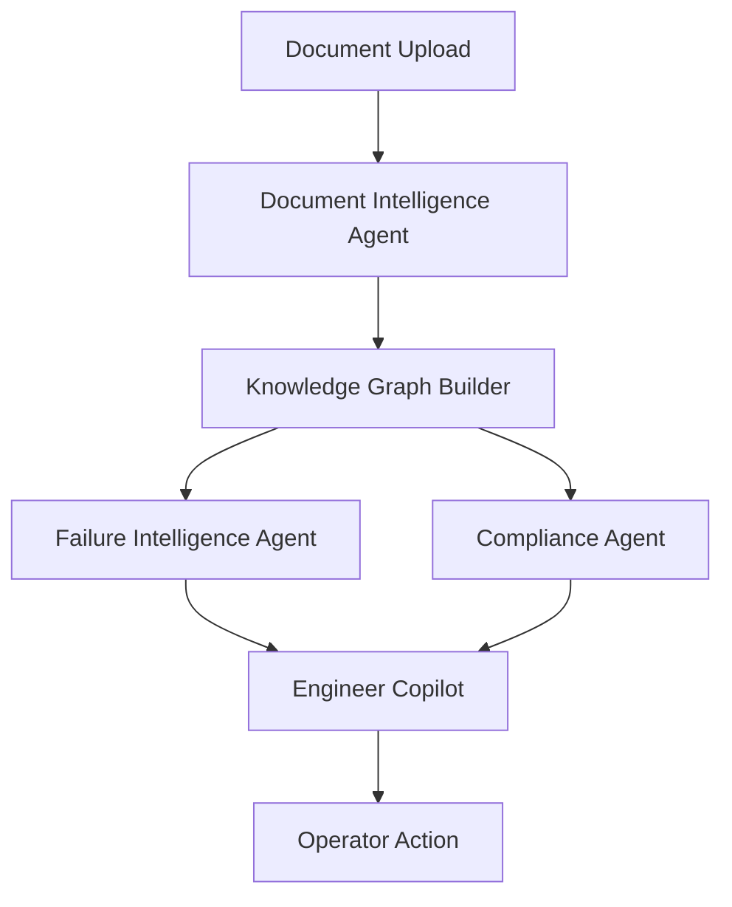

# PlantMind AI

Industrial Memory & Failure Prevention Engine.

## What it is

PlantMind AI is a practical industrial intelligence layer for plants that want to learn from their own history instead of repeating the same failures.

It takes maintenance reports, incident logs, inspection notes, SOPs, drawings, spreadsheets, and project documents, then turns them into a living memory of the plant.

Instead of acting like a generic chatbot, it connects the dots between equipment, incidents, procedures, and root causes so engineers can act earlier.

## What it can do

- Ingest PDFs, drawings, logs, SOPs, reports, Excel, CSV, and project docs
- Extract industrial entities and relationships
- Build a living knowledge graph
- Detect repeated failure patterns
- Produce proactive risk alerts
- Explain evidence with citations
- Support compliance checks and maintenance decisions

## Architecture



## Why this matters

- Saves time that is usually lost searching across disconnected plant documents
- Surfaces repeat-failure patterns before they become downtime
- Helps preserve lessons learned even when teams change shifts or roles
- Gives engineers evidence-backed guidance instead of vague suggestions

## Folder Structure

- `plantmind/api` FastAPI backend
- `plantmind/agents` AI workflows and domain agents
- `plantmind/core` storage, schemas, config, text utilities
- `plantmind/graph` NetworkX knowledge graph engine
- `plantmind/parsers` document parsing and OCR
- `plantmind/retrieval` ChromaDB memory store
- `plantmind/services` orchestration layer
- `plantmind/tools` demo seeding helpers
- `sample_data` seeded industrial documents

## Run Locally

1. Install dependencies

```bash
pip install -r requirements.txt
```

2. Start the FastAPI backend

```bash
uvicorn plantmind.api.main:app --reload
```

3. Start the Streamlit dashboard

```bash
streamlit run streamlit_app.py
```

## Demo Flow

1. Load sample data or upload your own report
2. Watch OCR, entity extraction, graph construction, and failure scoring happen in the app
3. Open the Knowledge Graph page
4. Ask the Engineer Copilot: `Why is Pump P101 at risk?`
5. Review citations and recommended actions

## Deployment

Best fit for hackathons and lightweight demos:

- Streamlit Cloud for the dashboard
- Render/Railway/Fly-like container hosting for FastAPI if needed

Set environment variables:

- `GEMINI_API_KEY`
- `GEMINI_MODEL`
- `GROQ_API_KEY`
- `GROQ_MODEL`
- `PLANTMIND_HOST`
- `PLANTMIND_PORT`

## Future Scope

- Add P&ID understanding with computer vision and symbol detection
- Extend the graph with a formal industrial ontology for richer reasoning
- Connect to CMMS or ERP systems for work-order tracking
- Add trend-based predictive maintenance models for rotating equipment
- Support multi-site plant memory so lessons learned can be shared across facilities

## Notes

This MVP is engineered to run on low-end hardware by using:

- SQLite for persistence
- TF-IDF similarity as a lightweight memory fallback
- Optional ChromaDB persistence
- Optional OCR if EasyOCR is installed
